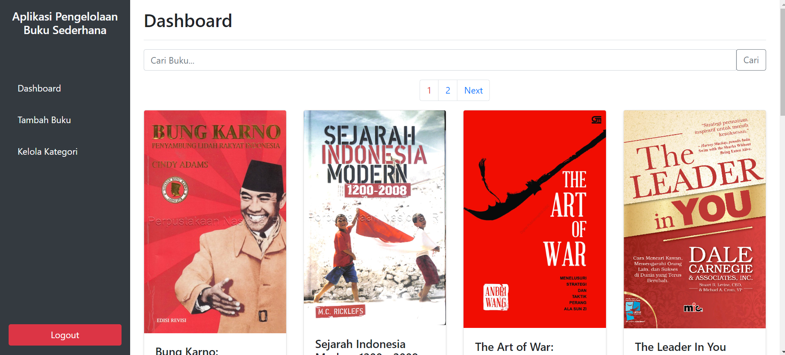
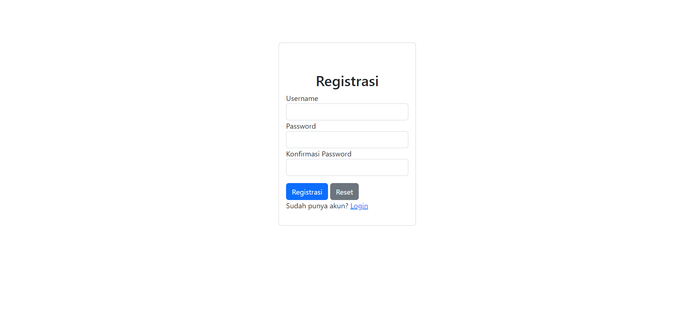
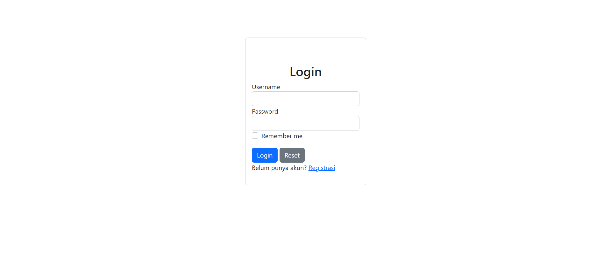
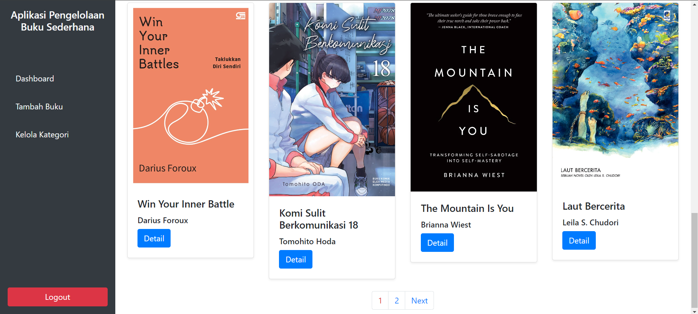
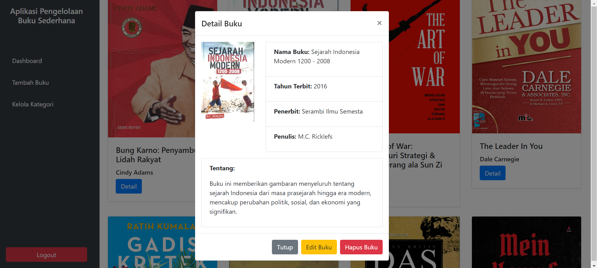
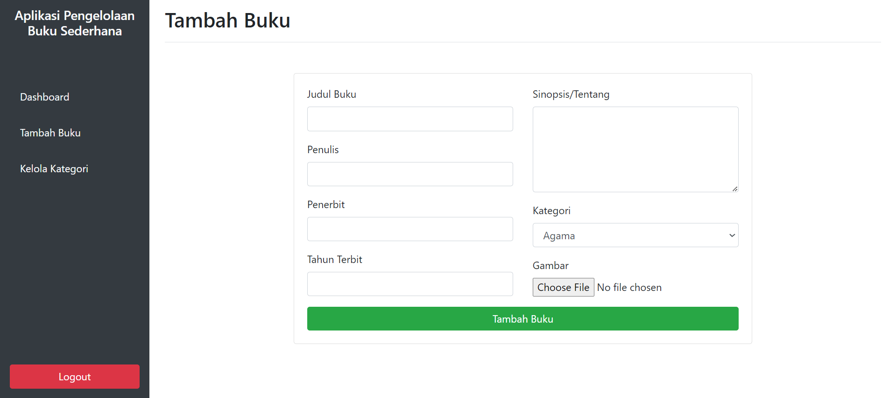
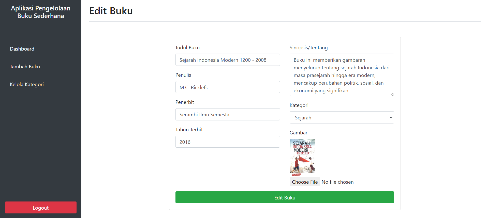
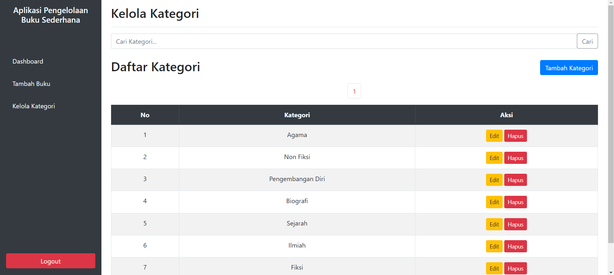

# Aplikasi Pengelolaan Buku Sederhana



## Tentang Aplikasi

Aplikasi Pengelolaan Buku Sederhana adalah sebuah proyek untuk mengelola data buku dengan menggunakan teknologi PHP, JavaScript, HTML, dan Bootstrap. Aplikasi ini memungkinkan pengguna untuk menambah, mengedit, dan menghapus informasi buku dengan antarmuka yang mudah digunakan.

### Fitur Utama
- **Tambah Buku:** Memungkinkan pengguna untuk menambahkan data buku baru.
- **Edit Buku:** Memungkinkan pengguna untuk mengedit informasi buku yang sudah ada.
- **Hapus Buku:** Memungkinkan pengguna untuk menghapus data buku.
- **Antarmuka Responsif:** Menggunakan Bootstrap untuk tampilan yang responsif di berbagai perangkat.

## Teknologi yang Digunakan
- **PHP:** Untuk logika backend dan pengelolaan data.
- **MYSQL:** Untuk pengelolaan database
- **JavaScript:** Untuk interaksi dan manipulasi DOM.
- **HTML:** Untuk struktur halaman.
- **Bootstrap:** Untuk desain antarmuka yang responsif.

## Cara Menggunakan

1. Clone repositori ini:
    ```sh
    git clone https://github.com/naufal225/Aplikasi-pengelolaan-buku-php.git
    ```
2. Masuk ke direktori proyek:
    ```sh
    cd Aplikasi-pengelolaan-buku-php
    ```
3. Jangan lupa untuk mengimport database sql
4. Jalankan server lokal (misalnya dengan menggunakan XAMPP atau MAMP) dan arahkan ke direktori proyek.

## Screenshot

### Register


### Login


### Dashboard


<!-- ### Dashboard 2
 -->

### Detail Buku


### Tambah Buku


### Edit Buku


### Kelola Kategori


## Kontak

Untuk informasi lebih lanjut, kamu bisa menghubungi saya di Instagram: 
<a href="https://instagram.com/nma225__" target="blank"></a>
---

**Dibuat oleh Naufal Ma'ruf Ashrori**
